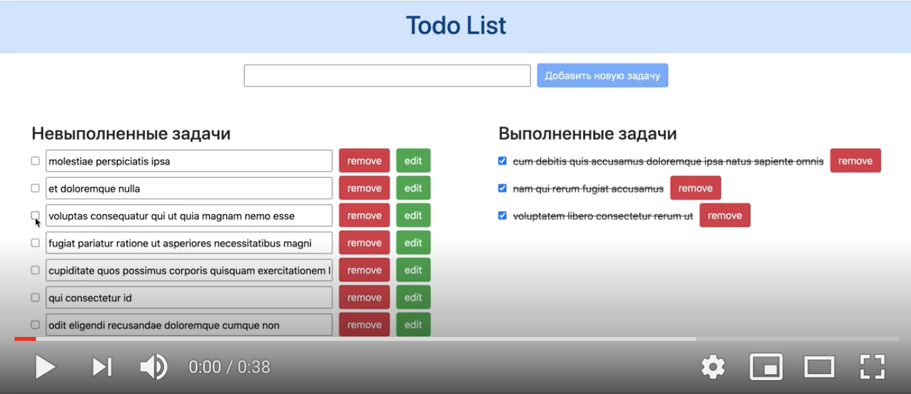

# todo-app
## Инструкция запуска приложения:
git clone https://github.com/marilisok/todo-app.git

cd todo-list/

npm install

node ./backend/app.js

ng serve --open --port 3030

## Скринкаст работы приложения

